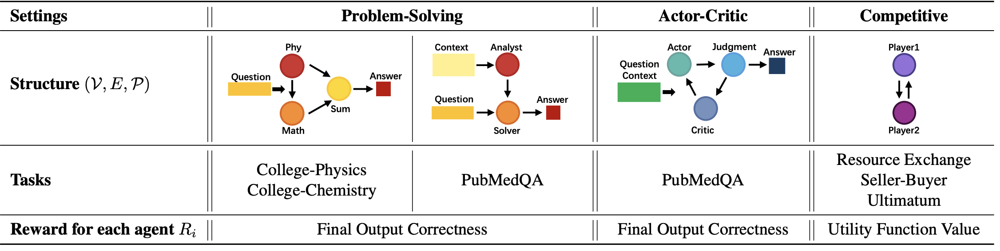

<!--- BADGES: START --->

[][#license-gh-package]
[][#arxiv-paper-package]


[#license-gh-package]: https://lbesson.mit-license.org/
[#arxiv-paper-package]: https://arxiv.org/pdf/2502.04780

<!--- BADGES: END --->
 
## SiriuS: Self-improving Multi-agent Systems via Bootstrapped Reasoning (NeurIPS 2025)
 
This is the repository for the paper [**SiriuS: Self-improving Multi-agent Systems via Bootstrapped Reasoning**](https://arxiv.org/pdf/2502.04780) (NeurIPS 2025).

SIRIUS is a self-improving multi-agent framework that continuously enhances reasoning ability by maintaining an experience library of successful trajectories and bootstrapping from failed ones.

In this paper, we explore several multi-agent settings where agents with distinct expertise collaborate to tackle challenging tasks — including **Problem-Solving**, **Actor–Critic**, and **Competitive** Setting.



### Problem-Solving


### Actor–Critic


### Competitive

```bibtex
@article{zhao2025sirius,
  title={SiriuS: Self-improving Multi-agent Systems via Bootstrapped Reasoning},
  author={Zhao, Wanjia and Yuksekgonul, Mert and Wu, Shirley and Zou, James},
  journal={arXiv preprint arXiv:2502.04780},
  year={2025}
}
```